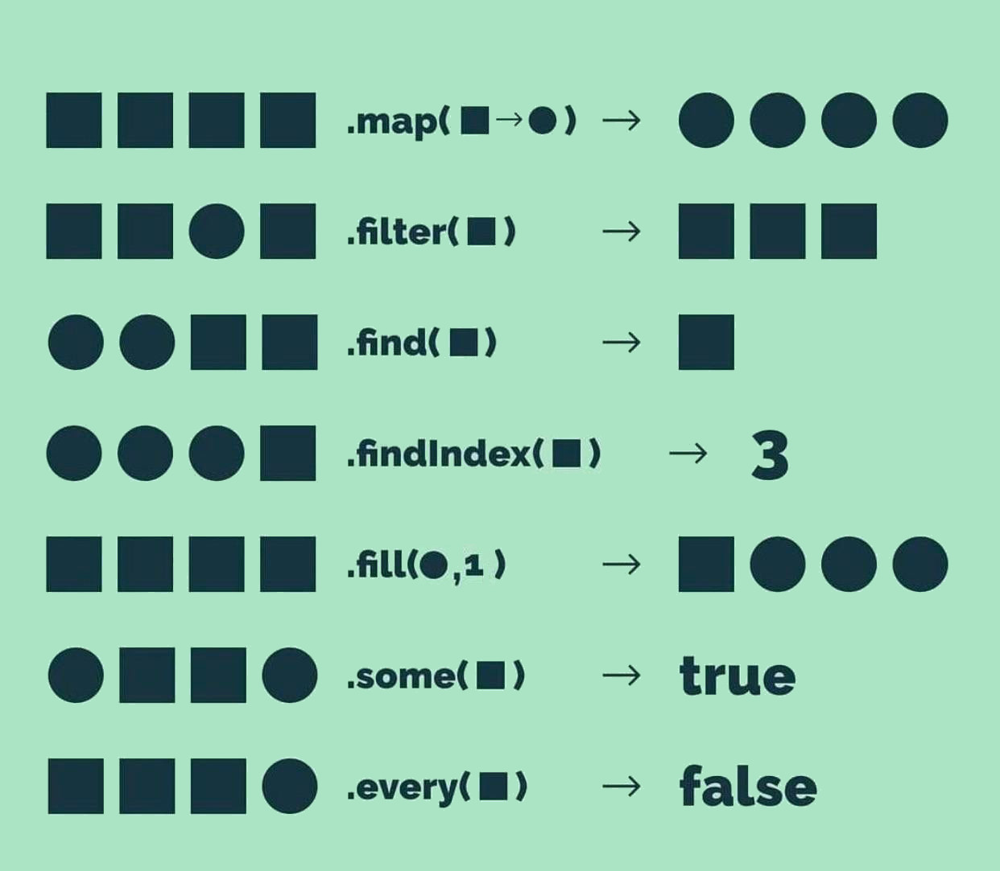

# Learning arrays

> Basicamente atualizando meus conhecimentos de array e postando aqui no github, também mantenho anotados em post'it na parede para facilitar visualização. 

### Aprendidos e em aprendizagem 

Estou estudando os métodos de arrays em javascript, aqui uma lista com os que eu já finalizei e os que ainda faltam: 

- [x] Slice: cria novo array sem alterar original do [indice1 até o (indice2)-1]
- [x] Push: adiciona elementos depois do último índice do array (altera original)
- [x] Concat: concatena dois arrays ou mais, passando por parâmetro o que deseja adicionar (não altera original) 
- [x] Filter: retorna uma lista com elementos que passaram no teste, pode ser usado com uma função callback (não altera o original);
- [ ] Tarefa 5 
- [ ] Tarefa 5 
- [ ] Tarefa 5 
- [ ] Tarefa 5 

## 🚀 Fique à vontade para copiar

## 📫 Contribuindo para <nome_do_projeto>
<!---Se o seu README for longo ou se você tiver algum processo ou etapas específicas que deseja que os contribuidores sigam, considere a criação de um arquivo CONTRIBUTING.md separado--->
Para contribuir com <nome_do_projeto>, siga estas etapas:

1. Bifurque este repositório.
2. Crie um branch: `git checkout -b <nome_branch>`.
3. Faça suas alterações e confirme-as: `git commit -m '<mensagem_commit>'`
4. Envie para o branch original: `git push origin <nome_do_projeto> / <local>`
5. Crie a solicitação de pull.

Como alternativa, consulte a documentação do GitHub em [como criar uma solicitação pull](https://help.github.com/en/github/collaborating-with-issues-and-pull-requests/creating-a-pull-request).

## 🤝 Colaboradores

Agradecemos às seguintes pessoas que contribuíram para este projeto:

<table>
  <tr>
    <td align="center">
      <a href="#">
         
        
          <b>Victor Hugo</b>
        
      </a>
    </td>
  </tr>
</table>

## 📝 Licença

Fique à vontade pra pegar o projeto e copiar.

## Obrigado a quem leu até aqui.
